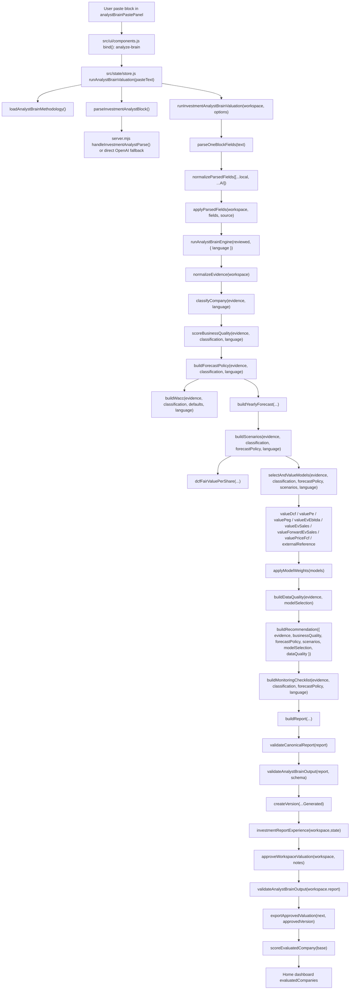

# Analytical Call Graph - Real Version 9 Execution Path

This graph follows the one-paste Investment Analyst Brain path. It excludes the old multi-form `runFixedMethodologyValuation()` path except where approval/export branches still share workflow utilities.

## Function Sequence

1. `src/state/store.js:178` `runAnalystBrainValuation` coordinates methodology load, optional AI parsing, and deterministic valuation.
2. `src/valuationWorkflow/workflow.js:261` `runInvestmentAnalystBrainValuation` merges local and AI parsed fields.
3. `src/analystBrain/engine.js:64` `runAnalystBrainEngine` executes the canonical deterministic pipeline.
4. `src/analystBrain/schemaValidator.js:23` validates the final JSON before accepting it.
5. `src/valuationWorkflow/workflow.js:534` exports only after investor approval.
